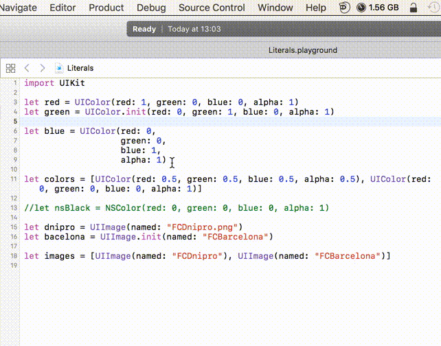

Literals Extension
==================

This Xcode 8 Source Code Extension generates Color and Image Literals

Usage
-----

Select code with colors or images that should be converted to literals. If nothing selected, whole file is converted

Installation
------------

1. Open ``Literals.xcodeproj``
2. Enable target signing for both the Application and the Source Code Extension using your own developer ID
3. Product > Archive
4. Right click archive > Show in Finder
5. Right click archive > Show Package Contents
6. Open Products, Applications
7. Drag ``Literals.app`` to your Applications folder
8. Run ``Literals.app`` and exit again.
9. Go to System Preferences -> Extensions -> Xcode Source Editor and enable the extension
10. The menu-item should now be available from Xcode's Editor menu.
